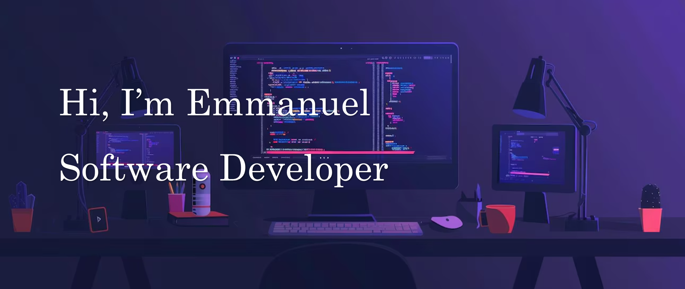

<h3 align="center">Aspiring Software Developer | Tech Enthusiast | AI & IoT Explorer | Digital Craftsman</h3>

# 🧑‍💻 About Me

Hello, I’m Emmanuel — an aspiring software developer passionate about crafting meaningful, user-focused digital solutions. 
I’m driven by the potential of technology to solve real-world problems and enhance everyday life. With a strong commitment to continuous learning, 
I strive to build software that is both purposeful and impactful.

🌐 Portfolio: [My Portfolio](https://portfolio-website-c6re.onrender.com)

💼 LinkedIn: [Emmanuel Maduka Agbeze](www.linkedin.com/in/agbeze-ema)

# 🎯 Interests

- 🤖 Artificial Intelligence
- 🌐 Internet of Things (IoT)
- 💻 Full Stack & Backend Development

# 🧰 Tech Stack

                                

<picture alt="Snake Animation">
  <source media="(prefers-color-scheme: dark)" srcset="https://raw.githubusercontent.com/EmmanuelM-A/EmmanuelM-A/output/github-snake-dark.svg" />
  <source media="(prefers-color-scheme: light)" srcset="https://raw.githubusercontent.com/EmmanuelM-A/EmmanuelM-A/output/github-snake.svg" />
  
</picture>

# 🚀 Current Ventures

- 🔧 Building: **RAG Chatbot**, **Graph Insight Tool**, **Blog API**
- 📚 Learning: AI, LLMs, Retrieved Augmented Generation (RAG), System Design

# 📈 GitHub Stats

	
	
	

